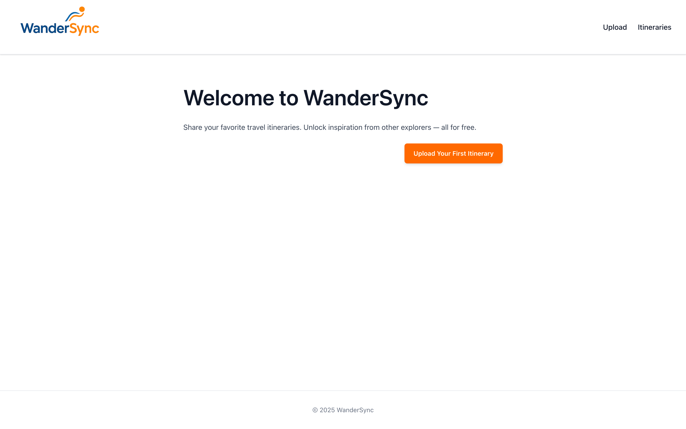
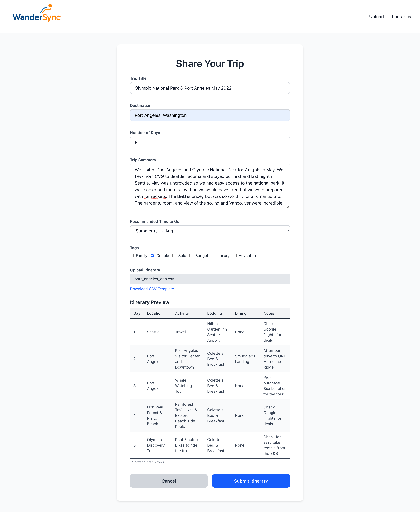
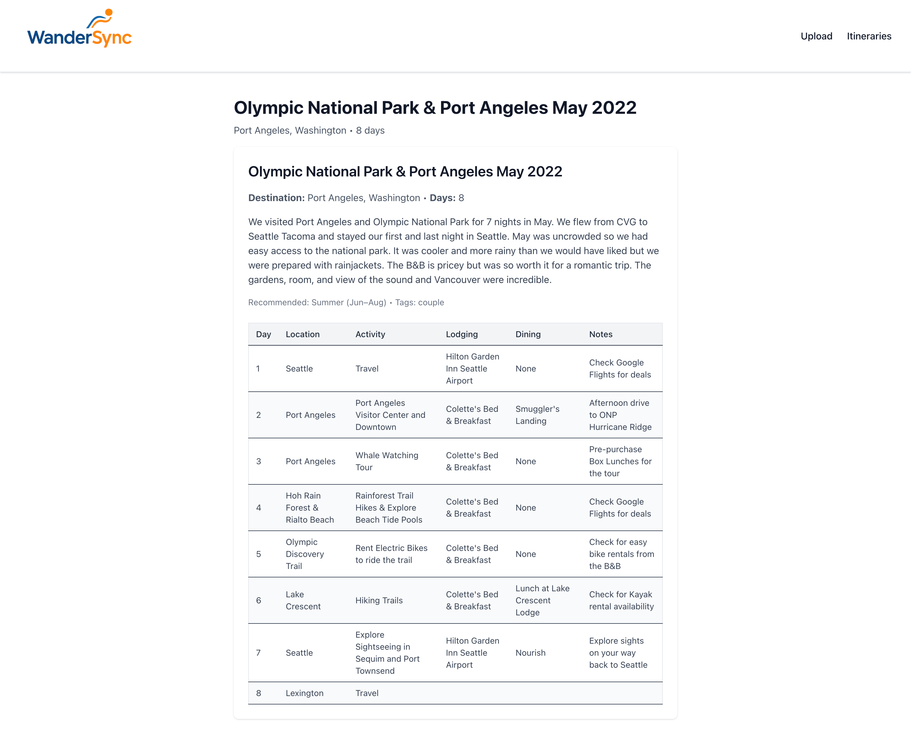

# 🌍 WanderSync

WanderSync is a simple, collaborative platform for sharing travel itineraries. Upload your trip as a CSV and instantly unlock inspiration from other explorers — all for free.

## ✨ Features

- Upload travel itineraries as CSV files
- Auto-preview uploaded trips before submission
- Add trip summary, tags (family, couple, solo, etc.), and recommended travel time
- View all submitted itineraries
- Click into detailed daily plans
- Responsive design using Tailwind CSS
- Lightweight, in-memory backend for fast prototyping

## 📸 Screenshots

### 🏠 Home Page


### ⬆️ Upload Page


### ✅ Success Page


### 📋 Itineraries List


### 🧭 Itinerary Detail


## 🛠 Tech Stack

- **Frontend**: Next.js, React, TypeScript, Tailwind CSS
- **Backend**: Next.js API routes (simulated in-memory DB)
- **CSV Parsing**: [PapaParse](https://www.papaparse.com/)
- **Deployment**: [Vercel](https://vercel.com/)

## 🚀 Getting Started

### 1. Clone the repo

```bash
git clone https://github.com/your-username/wandersync.git
cd wandersync
```

### 2. Install dependencies
```bash
npm install
```

### 3. Run the development server
```bash
npm run dev
```
Visit http://localhost:3000 to view it in the browser.

## 📁 File Structure
```text
wandersync/
├── public/
│   └── wandersync-logo.png
│   └── itinerary-template.csv
├── src/
│   ├── components/
│   │   └── Footer.tsx
│   │   └── Header.tsx
│   │   └── ItineraryCard.tsx
│   │   └── Layout.tsx
│   │   └── LogoHeader.tsx
│   ├── data/
│   │   └── mockDb.ts
│   ├── pages/
│   │   └── api/
│   │   │   ├── itinerary/
│   │   │   │   └── [id].tsx
│   │   |   ├── itinerary/index.tsx
│   │   ├── index.tsx
│   │   ├── upload.tsx
│   │   ├── success.tsx
│   │   ├── itinerary/
│   │   │   ├── index.tsx
│   │   │   └── [id].tsx
│   ├── services/
│   │   └── uploadService.ts
│   ├── types/
│   │   ├── itinerary.ts
│   │   └── uploadForm.ts
│   └── styles/
│       └── globals.css
├── .gitignore
├── package.json
├── tailwind.config.ts
├── postcss.config.js
└── README.md
```

## 🧪 Sample CSV Format

```sql
Day,Location,Activity,Lodging,Dining,Notes
```
You can download a template directly from the app.

## 📦 Deployment

This app is ready to deploy on Vercel. Just push to GitHub and import the repo in Vercel to go live.

## 📄 License

MIT — free to use, modify, and deploy.

Built with ❤️ by travel lovers.
